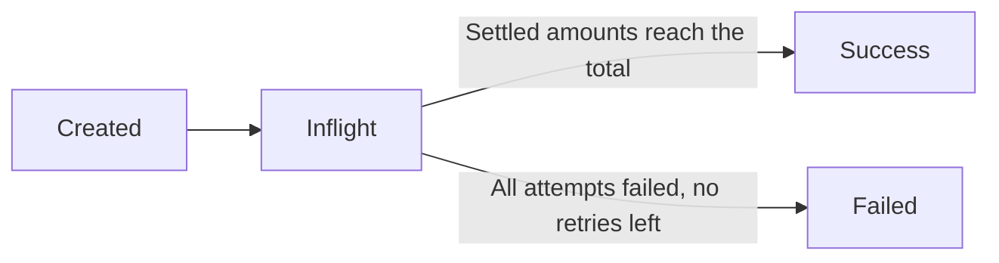
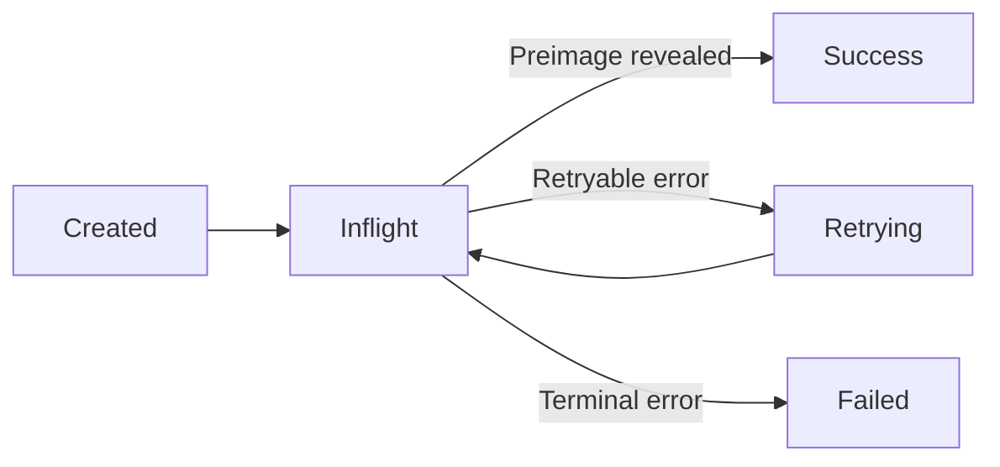

import { Callout } from 'fumadocs-ui/components/callout';

## TL;DR

Every payment goes through `Created` → `Inflight` → `Success` or `Failed`. A payment may be split into multiple attempts across different routes (multi-path). Failed attempts can be retried automatically. Funds are only released when the recipient reveals the preimage — otherwise they return to the sender.

Every payment in the Fiber network goes through a well-defined lifecycle — from the moment you call `send_payment` to the instant the recipient receives funds. Understanding this lifecycle is essential for debugging payment issues, building applications on Fiber, and reasoning about the security guarantees that time-locked contracts provide.

Fiber uses a **three-layer architecture**: a high-level **PaymentSession** represents your payment intent, one or more **Attempt**s handle routing and retry logic, and **TLCs** (Time-Locked Contracts) enforce conditional transfers on each channel along the route. This decoupled design enables multi-path payments — a single payment can be split across multiple routes — and ensures that funds are only released when cryptographic conditions are met.

## State Machine Overview

Fiber's payment system uses two independent state machines: **PaymentSession** (one per payment) and **Attempt** (one or more per session). The session status is derived from the aggregate state of its attempts.

### Session Lifecycle



A session is `Created` when the payment request is accepted, becomes `Inflight` as soon as the first TLC is dispatched, and reaches a terminal state (`Success` or `Failed`) only when all attempts have resolved.

### Attempt Lifecycle



Each attempt routes a portion of the payment through a specific path. If it fails with a retryable error (e.g., a channel temporarily lacks liquidity), it transitions to `Retrying` and is re-dispatched with a new route. Terminal errors (e.g., invoice expired, permanent channel failure) move it directly to `Failed`.

<Callout type="info">
  **How the two layers connect**: When a session is `Created`, the payment module splits the total amount into one or more attempts (routes). As each attempt reaches `Success`, its settled amount is added to the session's running total. The session transitions to `Success` when the sum of all successful attempts meets or exceeds the requested amount. If all attempts end up `Failed` and the retry limit is exhausted, the session becomes `Failed`.
</Callout>

## PaymentSession States

A `PaymentSession` represents the user's payment intent — "I want to send X amount to node Y." It tracks the overall progress across all routing attempts and is persisted to the store for the lifetime of the payment.

### Created

The initial state when a payment request is submitted via `send_payment`. The system has accepted the payment intent but has not yet dispatched any TLCs.

**What happens here**: The payment module validates the invoice (signature, expiry, amount), computes the maximum fee budget (default: 0.5% of the amount), checks available outbound channel liquidity, and invokes the path-finding algorithm. If multi-path payment (MPP) is enabled, the total amount is split into multiple attempts, each targeting a different route.

**Transition**: Moves to `Inflight` as soon as the first `AddTlc` is sent to the first-hop peer.

### Inflight

One or more routing attempts are actively being processed. Funds are locked in TLCs on each channel along the route, and onion packets are being forwarded hop by hop.

**What happens here**:
- Each attempt adds a TLC to the sender's first-hop channel and dispatches an onion packet
- Intermediate nodes peel the onion, validate fees and expiry, then forward a new TLC to the next hop
- As attempts settle (partially or fully), the settled amount accumulates on the session
- The session remains `Inflight` until either the full amount is collected or all attempts have been exhausted

**Key transitions from Inflight**:
- → **Success**: When the sum of settled amounts across all successful attempts equals or exceeds the total payment amount
- → **Failed**: When all attempts have failed and the retry limit has been reached, or a terminal error occurs

### Success

The payment has been completed. The full amount has been delivered to the recipient and the preimage has been revealed.

**What this means**: The recipient's node revealed the preimage (proof of payment) by including it in a `RemoveTlcFulfill` message. This preimage propagates backward through each hop, settling each TLC in sequence. All intermediate nodes have been paid their forwarding fees. The preimage is stored in the session and can be used as cryptographic proof of payment.

### Failed

The payment could not be completed. All routing attempts have been exhausted and no retryable paths remain.

**Common failure reasons**:

| Error Code | Meaning |
|------------|---------|
| `PermanentChannelFailure` | A channel on the route is closed or does not exist |
| `ChannelDisabled` | A channel on the route has been disabled by its operator |
| `UnknownNextPeer` | The next node in the route is not connected |
| `PermanentNodeFailure` | A node on the route is permanently unreachable |
| `IncorrectPaymentDetails` | The invoice amount, hash, or other details do not match |
| `InvoiceExpired` | The invoice has passed its expiry time |
| `InsufficientBalance` | The sender's channels do not have enough local balance |
| `TemporaryChannelFailure` | A channel temporarily lacks liquidity (retryable) |

The `failed_error` field on the session provides the most recent failure reason from the RPC response.

## Attempt States

An `Attempt` represents a single routing attempt for a portion of the payment amount. A PaymentSession can have one or more attempts (for multi-path payments). Each attempt carries its own route, retry counter, and status.

### Created

The attempt has been initialized with a specific amount, route, and onion packet, but the first-hop `AddTlc` has not yet been sent.

### Inflight

The first-hop `AddTlc` has been sent successfully and the TLC is propagating through the network. Each intermediate node is processing the onion packet and forwarding to the next hop.

### Success

The attempt has been successfully completed. The recipient (or an intermediate node) revealed the preimage via `RemoveTlcFulfill`, and the funds have been settled through the route. The settled amount is credited toward the parent PaymentSession.

### Retrying

The attempt failed, but the failure is **retryable** and the retry limit has not been reached. The system will automatically re-route and resend the attempt, potentially choosing a different path.

**When retrying happens**: An intermediate node was temporarily unavailable, a channel lacked sufficient liquidity at that moment, or a transient network error occurred. The system updates the network graph to mark failed channels or nodes before retrying, increasing the chance of finding a working path.

**Retry limits**: For single-path payments, the default retry limit is 5 attempts. For MPP payments, each part allows up to 3 retries, with the total capped at `max_parts × 3`. The retry delay uses an adaptive backoff (20 ms × pending retry count) to avoid thundering-herd effects.

### Failed

The attempt has permanently failed. Either the error is **not retryable** (e.g., `IncorrectPaymentDetails`, `InvoiceExpired`), or the retry limit has been reached.

## How a Payment Flows

To understand the full picture, here is what happens step by step when you call `send_payment`:

1. **Validation**: The invoice is parsed and validated (signature, expiry, amount match). The payment parameters are resolved — target pubkey, amount, max fee, hash algorithm, and optional trampoline hops.

2. **Route building**: The graph module runs a Dijkstra-like search backwards from the target to the source, using a probability-weighted cost model inspired by LND's bimodal routing. Each edge is scored based on historical success/failure data and channel capacity. For MPP, this step iterates to build multiple routes that collectively cover the total amount.

3. **Onion construction**: For each attempt, a Sphinx onion packet is constructed. The packet contains a per-hop payload (amount to forward, expiry, fee) encrypted for each node along the route. Only the intended recipient can decrypt the final payload; intermediate nodes see only their own instructions.

4. **TLC dispatch**: The first `AddTlc` is sent to the sender's first-hop peer, carrying the payment hash, amount, expiry, and the onion packet. The peer adds the TLC to their channel state.

5. **Forwarding**: When the first-hop peer commits the TLC (via `CommitmentSigned` / `RevokeAndAck`), it peels the onion packet. If it is not the final hop, it validates the fee and expiry, then creates a new outbound `AddTlc` on the next channel — linking the inbound and outbound TLCs via a `forwarding_tlc` reference. This process repeats at each hop.

6. **Settlement**: The final hop recognizes itself as the recipient (the onion indicates `is_last`). If the payment hash matches a known invoice, it reveals the preimage by sending `RemoveTlcFulfill` back to the previous hop. Each intermediate node then fulfills its upstream TLC using the same preimage, releasing funds hop by hop.

7. **Session update**: As each attempt settles, the `PaymentSession` recalculates its status. When the sum of successful attempt amounts reaches the requested total, the session transitions to `Success`.

## TLC State Machine

Under the hood, each TLC on a channel goes through its own state machine as the two channel peers coordinate via `CommitmentSigned` and `RevokeAndAck` messages. There are separate state tracks for outbound TLCs (those you offered) and inbound TLCs (those you received).

### Outbound TLC

```
LocalAnnounced ──[RevokeAndAck]──▶ Committed ──[peer sends RemoveTlc]──▶ RemoteRemoved
                                                                                    │
                                                              [CommitmentSigned]    ▼
                                                                          RemoveWaitAck
                                                                                    │
                                                              [RevokeAndAck]        ▼
                                                                        RemoveAckConfirmed
```

- **LocalAnnounced**: You sent `AddTlc` to your peer, waiting for commitment
- **Committed**: The TLC is locked into both parties' commitment transactions
- **RemoteRemoved**: The peer resolved the TLC (fulfilled or failed)
- **RemoveWaitAck**: Waiting for the final `RevokeAndAck` to confirm removal
- **RemoveAckConfirmed**: The TLC has been safely removed from channel state

### Inbound TLC

```
RemoteAnnounced ──[CommitmentSigned]──▶ AnnounceWaitAck ──[RevokeAndAck]──▶ Committed
                                                                                   │
                                                            [local RemoveTlc]      ▼
                                                                           LocalRemoved
                                                                                   │
                                                            [RevokeAndAck]         ▼
                                                                       RemoveAckConfirmed
```

- **RemoteAnnounced**: Received `AddTlc` from peer, not yet committed
- **AnnounceWaitAck**: Sent `CommitmentSigned`, waiting for peer's ACK
- **Committed**: The TLC is locked into both parties' commitment transactions
- **LocalRemoved**: This node resolved the TLC (fulfilled or failed)
- **RemoveAckConfirmed**: The TLC has been safely removed from channel state

<Callout type="info">
  The `CommitmentSigned` / `RevokeAndAck` exchange is the backbone of channel state updates. Every balance change — including TLC additions, removals, and fee updates — requires this two-step handshake. The revocation mechanism ensures that if a party submits an outdated commitment transaction on-chain, the other party can claim all channel funds as a penalty.
</Callout>

## Onion Routing

Fiber uses **Sphinx onion routing** to preserve payment privacy. Each hop along a route can only see its immediate predecessor and successor — it cannot determine the full path, the sender, or the recipient (unless it is the first or last hop).

### How It Works

When the sender constructs a payment, the route is encoded as a series of per-hop payloads:

| Field | Description |
|-------|-------------|
| `amount_to_forward` | How much this hop should forward to the next |
| `outgoing_channel_id` | The channel to forward on |
| `outgoing_tlc_expiry` | The expiry for the next hop's TLC |
| `fee` | Forwarding fee this hop earns |

These payloads are wrapped in layers of encryption — like an onion. The sender encrypts the payload for the last hop first, then wraps it for the second-to-last, and so on. Each node peels one layer using its shared secret (derived from ECDH with the sender's ephemeral session key) and forwards the remaining encrypted layers to the next hop.

### Error Propagation

When an error occurs at any hop, the failing node creates a `TlcErrPacket` encrypted with its shared secret. This error packet is passed backward through the route — each intermediate hop re-encrypts it using its own shared secret. When the error reaches the sender, the sender decrypts it layer by layer (using all shared secrets in reverse order) to identify the failing hop and the error code.

The error packet always undergoes exactly 27 decryption passes to prevent timing-based analysis of the failure location.

### Trampoline Routing

For payments to recipients that are not well-connected in the network graph, Fiber supports **trampoline routing**. The sender delegates route-finding to one or more intermediate "trampoline" nodes:

1. The sender finds a path only to the first trampoline node
2. A nested **trampoline onion packet** (embedded in the payment onion's custom records) encodes the trampoline hops and their instructions
3. Each trampoline node peels its layer, performs its own route-finding to the next trampoline node (or the final recipient), and forwards the payment

Trampoline routing is especially useful for mobile or light nodes that do not maintain a full network graph. The maximum number of trampoline hops is 5. MPP is only allowed with a single trampoline hop; multiple trampoline hops force single-path behavior.

## Multi-Path Payments

Fiber supports **Atomic Multi-path Payments (AMP)**, which split a large payment into smaller parts routed through different channels. This is critical for large payments when no single path has enough liquidity.

### How MPP Works

1. The `PaymentSession` in `Created` state computes how to split the total amount
2. The graph module iteratively finds routes — each call accounts for already-committed capacity on shared channels (via `GraphChannelStat`), preventing over-allocation
3. Each route becomes a separate `Attempt` with its own amount, path, and onion packet
4. A `payment_secret` is included in the invoice and embedded in each attempt's custom records, so the recipient can correlate partial payments
5. As each attempt settles, the partial amounts accumulate on the session
6. When the sum of successful attempt amounts reaches the total, the session transitions to `Success`

### MPP Eligibility

MPP requires three conditions:
- The invoice has `allow_mpp` set to `true`
- `max_parts` is greater than 1 (default: 12)
- The payment is not a keysend (keysend payments are always single-path)

<Callout type="warning">
  MPP is only allowed with a single trampoline hop. When multiple trampoline hops are specified, the payment is forced into single-path mode (`max_parts` is effectively 1).
</Callout>

## Payment Fees

Every intermediate node along a payment route charges a forwarding fee. Understanding fees is important for cost estimation and for setting appropriate fee limits.

### Fee Calculation

The forwarding fee for a single hop is computed as:

```
fee = ceil((amount_to_forward × tlc_fee_proportional_millionths) / 1,000,000)
```

Each node configures its own fee rate via `tlc_fee_proportional_millionths`. A value of `1000` corresponds to a 0.1% fee.

### Maximum Fee Budget

When you call `send_payment`, a maximum fee budget is computed automatically:

```
max_fee = amount × max_fee_rate / 1000
```

The default `max_fee_rate` is 5 (per thousand), meaning the sender allows up to **0.5%** of the payment amount in total fees. You can override this with `max_fee_amount` or `max_fee_rate` in the `send_payment` parameters.

The path-finding algorithm respects this budget — it will not select routes whose cumulative fees exceed the maximum. The session's `fee_paid` method reports the actual total fees after settlement.

### Route-Level Fees

The fee for a specific route is the difference between the amount locked at the first hop and the amount received at the final hop:

```
route_fee = first_hop_amount - receiver_amount
```

For MPP payments, the total fee is the sum of all successful attempt route fees.

## Monitoring Payment Status

### Using fnn-cli

```bash
# Check a specific payment
fnn-cli payment get_payment --payment-hash 0x...

# List all payments
fnn-cli payment list_payments
```

### Using RPC

```json
{
  "jsonrpc": "2.0",
  "method": "get_payment",
  "params": ["0x..."],
  "id": 1
}
```

### Interpreting the Response

The payment response includes:

| Field | Description |
|-------|-------------|
| `status` | Session status: `Created`, `Inflight`, `Success`, or `Failed` |
| `amount` | The total target amount |
| `fee_paid` | Total routing fees paid across all successful attempts |
| `failed_error` | The most recent error message (if failed) |

If `status` is `Inflight`, the payment is still being processed — likely waiting for TLC propagation or retry. Payments in `Inflight` for an extended period may indicate a stuck route; the system's periodic status check will eventually time out unresponsive attempts.

## Common Issues

| Symptom | Status | Likely Cause | Solution |
|---------|--------|--------------|----------|
| Payment stuck | `Inflight` (long time) | A hop is offline or unresponsive | Wait for TLC expiry timeout; the system will fail and retry the attempt |
| Payment failed immediately | `Failed` | No route with sufficient liquidity | Open a channel to a well-connected node, or try MPP |
| Partial payment delivered | `Inflight` (no progress) | Some attempts failed, remaining are retrying | Wait for retries or check `failed_error` for the failure reason |
| Fee too high | `Failed` | Route fees exceed `max_fee_amount` | Increase `max_fee_amount` or `max_fee_rate`, or use a shorter route |
| Wrong amount | `Failed` | Invoice amount mismatch | Verify the invoice amount and payment hash before paying |

## Related Topics

- [Channel Lifecycle](/docs/concept/channels/channel-lifecycle) — how channels support payment operations
- [Invoice](/docs/concept/payments/invoice-guide) — creating and paying invoices
- [Multi-Hop Routing](/docs/concept/routing/multi-hop) — how the routing graph and path-finding work
- [Trampoline Routing](/docs/concept/routing/trampoline-routing) — delegated route-finding for light nodes
- [Hold Invoice](/docs/concept/payments/hold-invoice) — deferred settlement for conditional payments
