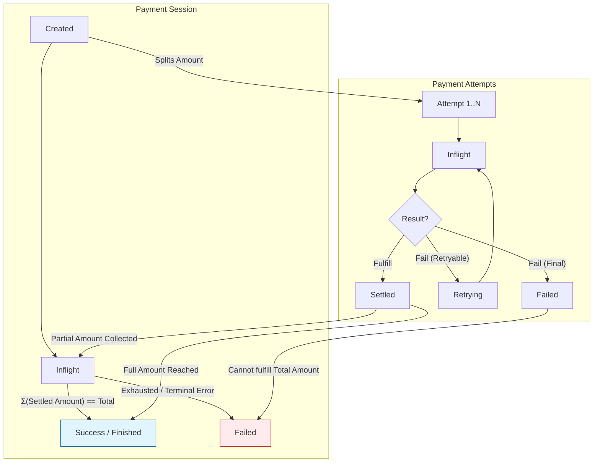

Every payment in the Fiber network goes through a well-defined lifecycle. Understanding this lifecycle is essential for debugging payment issues and building applications on Fiber.

Fiber uses a **two-level state machine**: a high-level **PaymentSession** represents your payment intent, and one or more **PaymentAttempt**s handle the actual routing and settlement. This decoupled design enables multi-path payments — a single payment can be split across multiple routes.

## TL;DR

A payment starts as `Created`, becomes `Inflight` when routed, and ends as `Success` or `Failed`. Each payment may have multiple attempts (multi-path). An attempt that fails may be retried automatically.

## State Machine Overview

The following diagram illustrates the relationship between PaymentSession and PaymentAttempt:



## PaymentSession States

A PaymentSession represents the user's payment intent — "I want to send X amount to node Y". It tracks the overall progress of the payment across all routing attempts.

### Created

The initial state when a payment request is submitted (e.g., via `send_payment` RPC). The system has accepted the payment intent but has not yet started routing.

**What happens here**: The payment module validates the invoice, checks available channels, and prepares routing strategies. If using multi-path payment (MPP), the total amount is split into multiple attempts.

### Inflight

One or more routing attempts are actively being processed. The payment is in progress — funds are being locked in TLCs (Time Locked Contracts) along the route.

**What happens here**:
- Each attempt locks funds in a TLC on each hop along its route
- As attempts settle (partially or fully), the settled amount accumulates
- The session stays in `Inflight` until either the full amount is reached or all attempts have exhausted

**Key transitions from Inflight**:
- → **Success**: When the sum of settled amounts across all attempts equals the total payment amount
- → **Failed**: When all attempts have been exhausted and no retryable paths remain, or a terminal error occurs

### Success / Finished

The payment has been completed. The full amount has been delivered to the recipient and the preimage has been revealed.

**What this means**: The recipient's node revealed the preimage (proof of payment) to claim the funds. The preimage is propagated back through the route, settling each TLC in sequence. All hops have been paid their forwarding fees.

### Failed

The payment could not be completed. All routing attempts have been exhausted and no retryable paths remain.

**Common failure reasons**:
- **No route found**: There is no path with sufficient liquidity between sender and receiver
- **Insufficient balance**: The sender's channels don't have enough local balance
- **Timeout**: A hop on the route failed to respond in time
- **Incorrect payment details**: Wrong invoice, expired invoice, or amount mismatch

## PaymentAttempt States

A PaymentAttempt represents a single routing attempt for a portion of the payment amount. A PaymentSession can have one or more attempts (for multi-path payments).

### Created (Attempt)

The attempt has been initialized with a specific amount and route, but has not yet been sent to the network.

### Inflight (Attempt)

The attempt is being processed through the network. TLCs have been added to each channel along the route, and the payment is propagating hop by hop.

**What happens here**: Each intermediate node receives the TLC, validates it, and forwards it to the next hop. The onion packet ensures each node only knows its previous and next hop.

### Settled

The attempt has been successfully completed. The recipient has revealed the preimage, and the funds have been settled through the route.

**What this means**: The TLC on each hop is removed, and the balance updates are applied. The settled amount is credited toward the parent PaymentSession.

### Retrying

The attempt failed, but the failure is **retryable**. The system will automatically create a new attempt, potentially using a different route.

**When retrying happens**:
- An intermediate node on the route was temporarily unavailable
- A channel along the route didn't have sufficient liquidity at that moment
- A temporary network error occurred

The system may try a different route or wait briefly before retrying. There is a maximum number of retries to prevent infinite loops.

### Failed (Attempt)

The attempt has permanently failed. The failure is **not retryable** — for example, the invoice has expired, or the recipient rejected the payment.

## How Multi-Path Payments Work

Fiber supports **Atomic Multi-path Payments (AMP)**, which split a large payment into smaller parts routed through different channels:

1. The PaymentSession in `Created` state splits the total amount into multiple PaymentAttempts
2. Each attempt routes through a different path in the network
3. As each attempt settles, the partial amounts accumulate
4. When the sum of settled amounts equals the total, the session transitions to `Success`

This increases payment success rates, especially when no single channel has enough liquidity for the full amount.

## Monitoring Payment Status

### Using fnn-cli

```bash
# Check a specific payment
fnn-cli payment get_payment --payment-hash 0x...

# List all payments
fnn-cli payment list_payments
```

### Using RPC

```json
{
  "jsonrpc": "2.0",
  "method": "get_payment",
  "params": ["0x..."],
  "id": 1
}
```

### Interpreting the response

The payment status will show:
- **session_status**: `Created`, `Inflight`, `Success`, or `Failed`
- **settled_amount**: How much has been successfully delivered so far
- **amount**: The total target amount

If `settled_amount < amount` and `session_status` is `Inflight`, the payment is still being processed (likely multi-path with more attempts pending).

## Common Issues

| Issue | Session Status | Likely Cause | Solution |
|-------|---------------|--------------|----------|
| Payment stuck | `Inflight` (long time) | A hop is offline or unresponsive | Wait for timeout, then retry |
| Payment failed immediately | `Failed` | No route with sufficient liquidity | Open a channel to a well-connected node |
| Partial payment delivered | `Inflight` (no progress) | Some attempts failed, remaining are retrying | Wait for retries or cancel |
| Wrong amount | `Failed` | Invoice amount mismatch | Verify the invoice amount before paying |

## Related Topics

- [Channel Lifecycle](/docs/guide/channels/channel-lifecycle) — how channels support payment operations
- [Invoice Guide](/docs/guide/payments/invoice-guide) — creating and paying invoices
- [Troubleshooting](/docs/guide/node-operator/troubleshooting) — common payment errors and solutions
